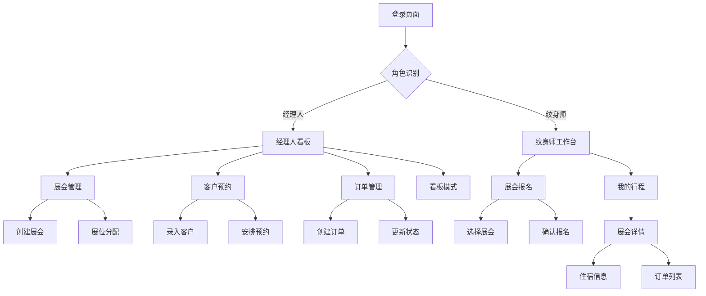

## 1. 产品概述
纹身工作室展会管理系统是一个专为纹身工作室设计的综合管理平台，用于管理欧洲纹身展会的参与、客户预约、订单处理等工作流程。系统为经理人和纹身师提供不同的工作界面，实现展会报名、客户管理、订单跟踪等核心功能。

该系统解决了纹身工作室在频繁参加展会时的信息管理混乱问题，提高了工作效率和客户服务质量。

## 2. 核心功能

### 2.1 用户角色
| 角色 | 注册方式 | 核心权限 |
|------|----------|----------|
| 经理人 | 管理员创建账号 | 管理所有展会信息、客户预约、订单、纹身师分配、看板管理 |
| 纹身师 | 经理人创建账号 | 查看展会信息、报名参展、查看个人行程和订单、更新订单状态 |

### 2.2 功能模块
系统包含以下核心页面：
1. **登录页面**：用户身份验证，角色识别
2. **经理人看板**：总览所有展会、预约、订单状态
3. **展会管理页面**：创建编辑展会信息、展位分配
4. **客户预约管理**：客户信息录入、预约时间安排、纹身师分配
5. **订单管理中心**：订单详情、金额、支付方式、状态跟踪
6. **纹身师工作台**：展会报名、个人行程、订单查看
7. **展会详情页面**：展会信息、住宿安排、订单列表

### 2.3 页面详情
| 页面名称 | 模块名称 | 功能描述 |
|----------|----------|----------|
| 登录页面 | 身份验证 | 输入用户名密码登录，根据角色跳转不同界面 |
| 经理人看板 | 数据总览 | 显示本周展会数量、进行中预约数、待处理订单数、收入统计 |
| 经理人看板 | 展会列表 | 卡片式展示所有展会，显示时间地点展位信息 |
| 经理人看板 | 预约看板 | 看板视图展示预约状态（待确认/已确认/进行中/已完成） |
| 展会管理 | 展会创建 | 填写展会名称、时间地点、展位数量、所需纹身师人数 |
| 展会管理 | 展位分配 | 为每个展位分配纹身师，设置工作时间 |
| 客户预约 | 客户信息 | 录入客户姓名、联系方式、纹身需求、参考图片 |
| 客户预约 | 预约安排 | 选择展会、时间slot、纹身师、纹身类型 |
| 订单管理 | 订单详情 | 显示客户信息、纹身设计、价格、定金、尾款 |
| 订单管理 | 支付跟踪 | 记录支付方式、支付状态、支付时间 |
| 纹身师工作台 | 展会报名 | 查看待报名展会，显示所需人数和已报名人数 |
| 纹身师工作台 | 我的行程 | 列表展示已报名展会，显示时间地点 |
| 展会详情 | 基本信息 | 展会名称、时间、地点、展位号 |
| 展会详情 | 住宿信息 | 酒店名称、地址、入住退房时间、房间号 |
| 展会详情 | 订单列表 | 显示分配给自己的所有订单及状态 |

## 3. 核心流程

### 经理人工作流程：
1. 登录系统进入看板界面
2. 创建新的展会信息，设置展位和人员需求
3. 查看客户预约申请，分配纹身师和时间
4. 创建订单，记录纹身细节和金额
5. 跟踪订单状态，更新支付信息
6. 使用看板模式监控所有预约和订单进度

### 纹身师工作流程：
1. 登录系统进入个人工作台
2. 在展会报名区查看可报名展会
3. 选择展会进行报名，查看报名状态
4. 在我的行程中查看已报名展会详情
5. 进入具体展会查看住宿安排和分配订单
6. 更新订单状态（进行中/已完成）

## 4. 用户界面设计

### 4.1 设计风格
- **主色调**：深灰色 (#2D2D2D) 搭配红色 (#DC143C) 强调色，体现纹身文化
- **按钮样式**：圆角矩形，悬停效果，主要操作用红色
- **字体**：主要使用无衬线字体，标题18-24px，正文14-16px
- **布局风格**：卡片式布局，左侧导航，主内容区域分块展示
- **图标风格**：使用简约线条图标，符合现代审美

### 4.2 页面设计概览
| 页面名称 | 模块名称 | UI元素 |
|----------|----------|--------|
| 经理人看板 | 统计卡片 | 顶部显示4个统计卡片，圆角边框，阴影效果，数字大字体显示 |
| 经理人看板 | 展会卡片 | 网格布局，每个展会卡片显示封面图、时间、地点、状态标签 |
| 经理人看板 | 看板视图 | 类似Trello的看板，拖拽功能，不同状态用不同颜色标识 |
| 纹身师工作台 | 报名列表 | 表格形式展示展会，报名按钮醒目，显示剩余名额 |
| 展会详情 | 信息区块 | 分区块展示，住宿信息用酒店图标，订单用列表形式 |

### 4.3 响应式设计
- 采用桌面端优先设计，适配1280px以上屏幕
- 平板端适配768px-1279px，导航栏变为顶部tab
- 手机端适配320px-767px，采用底部导航，卡片单列显示
- 支持触摸操作，按钮大小适合手指点击