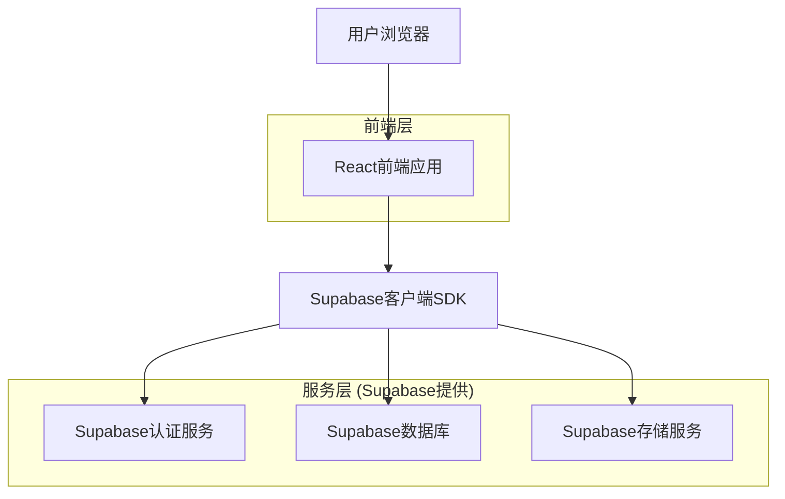
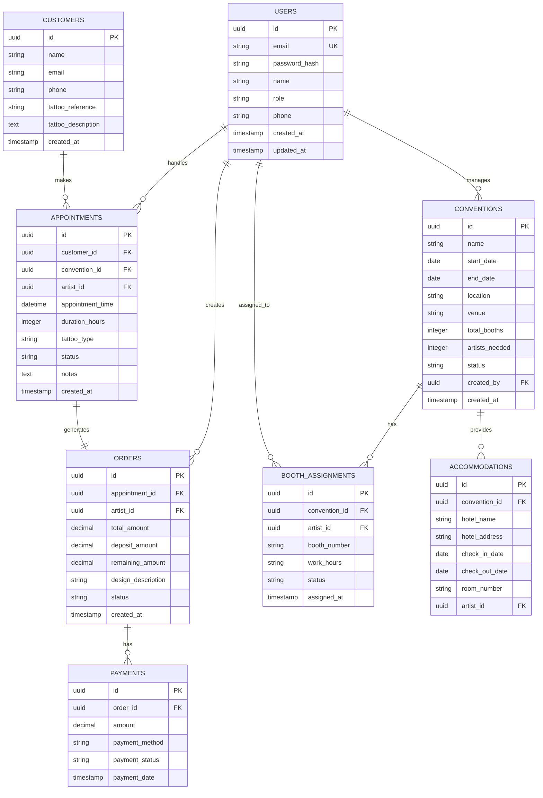
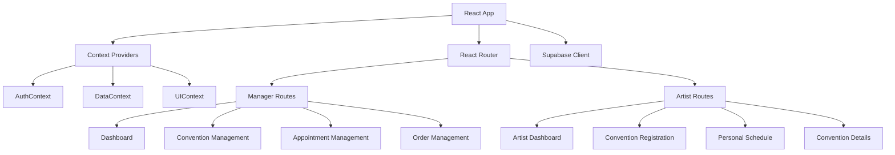

## 1. 架构设计



## 2. 技术描述

* **前端**: React\@18 + tailwindcss\@3 + vite

* **初始化工具**: vite-init

* **后端**: Supabase (包含认证、PostgreSQL数据库、文件存储)

* **状态管理**: React Context + useReducer

* **路由**: React Router v6

* **UI组件库**: HeadlessUI + 自定义组件

## 3. 路由定义

| 路由                     | 用途            |
| ---------------------- | ------------- |
| /login                 | 登录页面，用户身份验证   |
| /manager/dashboard     | 经理人看板，总览所有数据  |
| /manager/conventions   | 展会管理页面，创建编辑展会 |
| /manager/appointments  | 客户预约管理页面      |
| /manager/orders        | 订单管理中心        |
| /artist/dashboard      | 纹身师工作台首页      |
| /artist/conventions    | 展会报名页面        |
| /artist/schedule       | 我的行程页面        |
| /artist/convention/:id | 展会详情页面        |
| /profile               | 用户个人信息页面      |

## 4. 数据模型

### 4.1 数据模型定义



### 4.2 数据定义语言

```sql
-- 用户表
CREATE TABLE users (
    id UUID PRIMARY KEY DEFAULT gen_random_uuid(),
    email VARCHAR(255) UNIQUE NOT NULL,
    password_hash VARCHAR(255) NOT NULL,
    name VARCHAR(100) NOT NULL,
    role VARCHAR(20) NOT NULL CHECK (role IN ('manager', 'artist')),
    phone VARCHAR(20),
    created_at TIMESTAMP WITH TIME ZONE DEFAULT NOW(),
    updated_at TIMESTAMP WITH TIME ZONE DEFAULT NOW()
);

-- 展会表
CREATE TABLE conventions (
    id UUID PRIMARY KEY DEFAULT gen_random_uuid(),
    name VARCHAR(200) NOT NULL,
    start_date DATE NOT NULL,
    end_date DATE NOT NULL,
    location VARCHAR(200) NOT NULL,
    venue VARCHAR(200),
    total_booths INTEGER DEFAULT 1,
    artists_needed INTEGER DEFAULT 1,
    status VARCHAR(20) DEFAULT 'upcoming' CHECK (status IN ('upcoming', 'ongoing', 'completed')),
    created_by UUID REFERENCES users(id),
    created_at TIMESTAMP WITH TIME ZONE DEFAULT NOW()
);

-- 展位分配表
CREATE TABLE booth_assignments (
    id UUID PRIMARY KEY DEFAULT gen_random_uuid(),
    convention_id UUID REFERENCES conventions(id) ON DELETE CASCADE,
    artist_id UUID REFERENCES users(id),
    booth_number VARCHAR(50),
    work_hours VARCHAR(100),
    status VARCHAR(20) DEFAULT 'assigned' CHECK (status IN ('assigned', 'confirmed', 'cancelled')),
    assigned_at TIMESTAMP WITH TIME ZONE DEFAULT NOW()
);

-- 客户表
CREATE TABLE customers (
    id UUID PRIMARY KEY DEFAULT gen_random_uuid(),
    name VARCHAR(100) NOT NULL,
    email VARCHAR(255),
    phone VARCHAR(20),
    tattoo_reference TEXT,
    tattoo_description TEXT,
    created_at TIMESTAMP WITH TIME ZONE DEFAULT NOW()
);

-- 预约表
CREATE TABLE appointments (
    id UUID PRIMARY KEY DEFAULT gen_random_uuid(),
    customer_id UUID REFERENCES customers(id),
    convention_id UUID REFERENCES conventions(id),
    artist_id UUID REFERENCES users(id),
    appointment_time TIMESTAMP WITH TIME ZONE NOT NULL,
    duration_hours INTEGER DEFAULT 1,
    tattoo_type VARCHAR(100),
    status VARCHAR(20) DEFAULT 'pending' CHECK (status IN ('pending', 'confirmed', 'in_progress', 'completed', 'cancelled')),
    notes TEXT,
    created_at TIMESTAMP WITH TIME ZONE DEFAULT NOW()
);

-- 订单表
CREATE TABLE orders (
    id UUID PRIMARY KEY DEFAULT gen_random_uuid(),
    appointment_id UUID REFERENCES appointments(id),
    artist_id UUID REFERENCES users(id),
    total_amount DECIMAL(10,2) NOT NULL,
    deposit_amount DECIMAL(10,2) DEFAULT 0,
    remaining_amount DECIMAL(10,2) DEFAULT 0,
    design_description TEXT,
    status VARCHAR(20) DEFAULT 'pending' CHECK (status IN ('pending', 'deposit_paid', 'paid', 'cancelled')),
    created_at TIMESTAMP WITH TIME ZONE DEFAULT NOW()
);

-- 支付记录表
CREATE TABLE payments (
    id UUID PRIMARY KEY DEFAULT gen_random_uuid(),
    order_id UUID REFERENCES orders(id) ON DELETE CASCADE,
    amount DECIMAL(10,2) NOT NULL,
    payment_method VARCHAR(50) CHECK (payment_method IN ('cash', 'card', 'transfer', 'other')),
    payment_status VARCHAR(20) DEFAULT 'pending' CHECK (payment_status IN ('pending', 'completed', 'failed')),
    payment_date TIMESTAMP WITH TIME ZONE DEFAULT NOW()
);

-- 住宿信息表
CREATE TABLE accommodations (
    id UUID PRIMARY KEY DEFAULT gen_random_uuid(),
    convention_id UUID REFERENCES conventions(id) ON DELETE CASCADE,
    artist_id UUID REFERENCES users(id),
    hotel_name VARCHAR(200),
    hotel_address TEXT,
    check_in_date DATE,
    check_out_date DATE,
    room_number VARCHAR(50)
);

-- 创建索引
CREATE INDEX idx_users_email ON users(email);
CREATE INDEX idx_users_role ON users(role);
CREATE INDEX idx_conventions_dates ON conventions(start_date, end_date);
CREATE INDEX idx_appointments_artist ON appointments(artist_id);
CREATE INDEX idx_appointments_convention ON appointments(convention_id);
CREATE INDEX idx_appointments_status ON appointments(status);
CREATE INDEX idx_orders_artist ON orders(artist_id);
CREATE INDEX idx_orders_status ON orders(status);
CREATE INDEX idx_payments_order ON payments(order_id);

-- 设置权限
GRANT SELECT ON users TO anon;
GRANT ALL PRIVILEGES ON users TO authenticated;
GRANT SELECT ON conventions TO anon;
GRANT ALL PRIVILEGES ON conventions TO authenticated;
GRANT SELECT ON appointments TO anon;
GRANT ALL PRIVILEGES ON appointments TO authenticated;
GRANT SELECT ON orders TO anon;
GRANT ALL PRIVILEGES ON orders TO authenticated;
GRANT SELECT ON payments TO anon;
GRANT ALL PRIVILEGES ON payments TO authenticated;
GRANT SELECT ON accommodations TO anon;
GRANT ALL PRIVILEGES ON accommodations TO authenticated;
GRANT SELECT ON booth_assignments TO anon;
GRANT ALL PRIVILEGES ON booth_assignments TO authenticated;
GRANT SELECT ON customers TO anon;
GRANT ALL PRIVILEGES ON customers TO authenticated;

-- 创建行级安全策略
ALTER TABLE users ENABLE ROW LEVEL SECURITY;
ALTER TABLE conventions ENABLE ROW LEVEL SECURITY;
ALTER TABLE appointments ENABLE ROW LEVEL SECURITY;
ALTER TABLE orders ENABLE ROW LEVEL SECURITY;
ALTER TABLE payments ENABLE ROW LEVEL SECURITY;
ALTER TABLE accommodations ENABLE ROW LEVEL SECURITY;
ALTER TABLE booth_assignments ENABLE ROW LEVEL SECURITY;
ALTER TABLE customers ENABLE ROW LEVEL SECURITY;

-- 用户只能查看和更新自己的信息
CREATE POLICY users_self ON users FOR ALL USING (auth.uid() = id);

-- 经理可以查看所有数据，纹身师只能查看相关数据
CREATE POLICY conventions_manager ON conventions FOR ALL USING (
  EXISTS (
    SELECT 1 FROM users WHERE id = auth.uid() AND role = 'manager'
  )
);

CREATE POLICY appointments_artist ON appointments FOR ALL USING (
  artist_id = auth.uid() OR 
  EXISTS (
    SELECT 1 FROM users WHERE id = auth.uid() AND role = 'manager'
  )
);
```

## 5. 前端架构设计



## 6. 核心组件设计

### 6.1 通用组件

* `Layout`: 主布局组件，包含导航栏和侧边栏

* `PrivateRoute`: 路由保护组件，检查用户认证状态

* `RoleRoute`: 角色路由组件，根据用户角色渲染不同内容

* `LoadingSpinner`: 加载状态组件

* `ErrorBoundary`: 错误边界组件

### 6.2 业务组件

* `ConventionCard`: 展会信息卡片

* `AppointmentKanban`: 预约看板组件

* `OrderList`: 订单列表组件

* `PaymentTracker`: 支付状态跟踪组件

* `BoothAssignment`: 展位分配组件

* `AccommodationInfo`: 住宿信息展示组件

